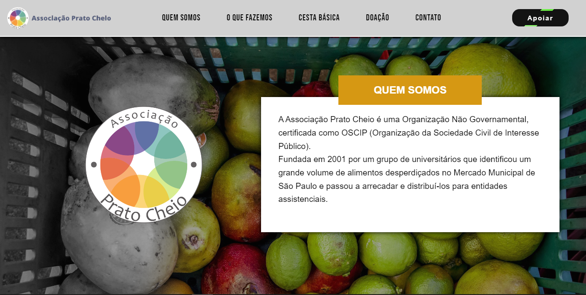
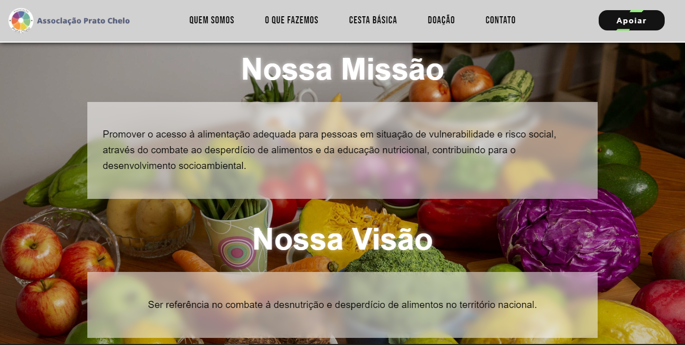
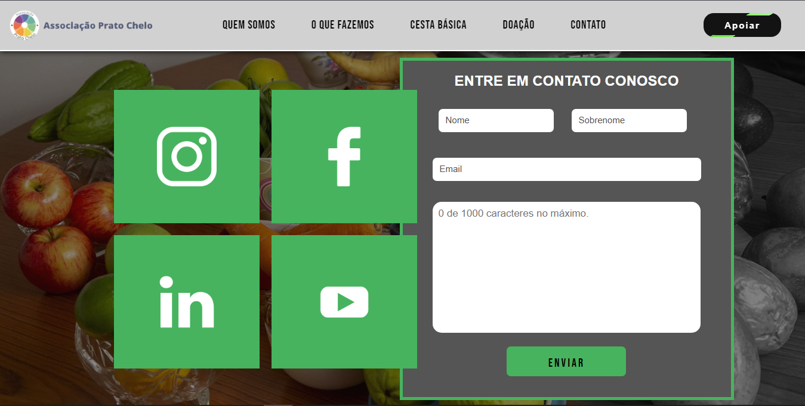

<h1>Projeto de Melhoria do Site da ONG "Associação Prato Cheio"</h1>
<h3>Descrição do Projeto</h3>

Este projeto foi desenvolvido como parte de um trabalho acadêmico cujo objetivo era aplicar conceitos de design e desenvolvimento web para melhorar o site de uma ONG existente. A ONG escolhida para o projeto foi a "Associação Prato Cheio", uma instituição dedicada à redução do desperdício de alimentos e à redistribuição de alimentos excedentes para pessoas em situação de vulnerabilidade.

<h3>Objetivo do Projeto</h3>

O objetivo principal deste trabalho foi reformular o site da Associação Prato Cheio para torná-lo mais acessível, atraente e funcional, melhorando a experiência do usuário (UX) e a interface do usuário (UI) por meio de técnicas modernas de design e boas práticas de desenvolvimento.

<h2>Tecnologias Utilizadas</h2>
<<<<<<< HEAD

<h4><a href="https://dev-gabriell.github.io/ongPrincipal/" target="_blank">Clique aqui pra acessar a página</a></h4>

<h2>Algumas imagens do Site: </h2>

=======
